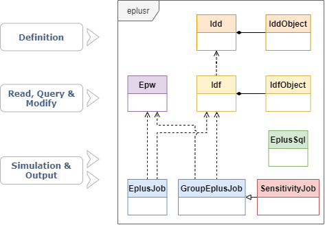

```{r setup, include = FALSE}
knitr::opts_chunk$set(
    collapse = TRUE,
    comment = "#>",
    screenshot.force = FALSE,
    fig.align = "center"
)

# the default output hook
hook_output <- knitr::knit_hooks$get("output")
knitr::knit_hooks$set(output = function(x, options) {
    if (!is.null(n <- options$out.lines)) {
        x <- unlist(strsplit(x, "\n", fixed = TRUE))
        if (length(x) > n) {
            # truncate the output
            x <- c(head(x, n), "....", "")
        } else {
            x <- c(x, "")
        }
        x <- paste(x, collapse = "\n") # paste first n lines together
    }
    hook_output(x, options)
})

options(crayon.enabled = FALSE)
options(data.table.print.class = TRUE)

library(eplusr)
if (!is_avail_eplus(23.1)) install_eplus(23.1)
```

This vignette introduces eplusr class structure, how to read EnergyPlus IDFs
and perform modifications on them. Familiarity with
[data.table](https://cloud.r-project.org/package=data.table) is useful, but not
essential to follow this vignette.

---

# Class structure

Below shows the class structure in eplusr.

```{r, echo = FALSE, figure.width = "400px"}

```

Basically, eplusr uses `Idf` class to present the whole IDF file and `IdfObject`
class to present a single object in an IDF. Both `Idf` and `IdfObject` class
contain member functions for helping modify the data in IDF so it complies with
the underlying EnergyPlus IDD (Input Data Dictionary). Similarly, IDD file is
wrapped into two classes, i.e. `Idd` and `IddObject`.

Besides, `Epw` class is used to present EnergyPlus Weather files; `EplusJob`
and `GroupEplusJob` to run single and multiple EnergyPlus simulations and
collect outputs, `ParametricJob` to run parametric EnergyPlus simulations and
collect all outputs.

It is highly recommended to read the documentation to get a thorough
understanding on each class.

# Preparation

Parsing an IDF requires the IDD data of that version, which serves as the
schema. The IDD file will be parsed first and an `Idd` object will be created and
cached. That `Idd` object will be reused whenever parsing IDFs with that
version. For more details, please see `?use_idd()` and `?idd`.

## Locate EnergyPlus

Usually, when you try to edit an IDF, the corresponding EnergyPlus is
likely to be installed already. If EnergyPlus is installed in standard location
(`C:\EnergyPlusVX-Y-0` on Windows, `/usr/local/EnergyPlus-X-Y-0` on Linux and
`/Applications/EnergyPlus-X-Y-0` on macOS), eplusr is able to find it and use
the `Energy+.idd` file distributed with that release to parse the input IDF.

You can get all detected EnergyPlus versions using `avail_eplus()` and meta
data of EnergyPlus configuration using `eplus_config()`.

```{r avail_eplus}
avail_eplus()

eplus_config(23.1)
```

If your EnergyPlus was not installed in standard location, you can add that
location using `use_eplus()`. After adding, all models of that version will use
this path to call EnergyPlus.

```{r use_eplus, eval = FALSE}
use_eplus("C:/EnergyPlusV23-1-0")
```

If the needed version of EnergyPlus was not installed, you can use
`install_eplus()` to install it.

```{r install, eval = FALSE}
install_eplus(ver = 23.1)
```

## Download EnergyPlus IDD

Sometimes you may just want to edit the model without installing the whole
EnergyPlus software. You can just download the IDD file of that version using
`download_idd()` or set `download` to `TRUE` in `use_idd()`. The code below will
download IDD file for EnergyPlus v23.1.0, parse it and create an `Idd` object
that will be used whenever parsing all EnergyPlus models of version v23.1.

```{r idd_dl, eval = FALSE}
path_idd <- download_idd(23.1, dir = tempdir())
use_idd(path_idd)

# OR
use_idd(23.1, download = TRUE)
```

# Read and parse IDF

All IDF reading process starts with function `read_idf()`, which returns an
`Idf` object. The IDF will be printed in a similar style you see in IDF Editor,
with additional heading lines showing the `Path`, `Version` of the model. The
classes of objects in the model are ordered by groups and the number of objects
in classes are shown in square bracket.

Now let's read an IDF file distributed with EnergyPlus 23.1. As we have already
got the IDD, we can just ignore the `idd` argument.

**Note**: Once an EnergyPlus version `X.Y` is successfully located, all IDFs
with versions lower than `X.Y` can be parsed. For example, if you have
EnergyPlus v9.1 installed, all IDFs from v7.2 to v9.1 can be parsed using
simply `read_idf(path)` without specifying `idd`. This is because eplusr will
use IDD files distributed with EnergyPlus VersionUpdater program.

```{r read, out.lines = 10}
path <- file.path(eplus_config(23.1)$dir, "ExampleFiles/5Zone_Transformer.idf")
model <- read_idf(path)

model
```

# Methods in `Idf` class

`Idf` class provides lots of methods to programmatically query and modify
EnergyPlus models. See table below. This vignette will demonstrate some of
them.

| Category            | Method                   | Functionality                                         |
| :---                | :---                     | :---                                                  |
| Basic Info          | `$version()`             | Get Idf version                                       |
|                     | `$path()`                | Get Idf file path                                     |
|                     | `$group_name()`          | Get group names                                       |
|                     | `$class_name()`          | Get class names                                       |
|                     | `$is_valid_group()`      | Check group existence                                 |
|                     | `$is_valid_class()`      | Check class existence                                 |
| Definition          | `$definition()`          | Get corresponding `IddObject`                         |
| Object Info         | `$object_id()`           | Get object unique ID                                  |
|                     | `$object_name()`         | Get object name                                       |
|                     | `$object_num()`          | Get object number in class                            |
|                     | `$is_valid_id()`         | Check object ID existence                             |
|                     | `$is_valid_name()`       | Check object name existence                           |
| Object Relation     | `$object_relation()`     | Get object relation with others                       |
| Object Query        | `$object()`              | Get single object                                     |
|                     | `$objects()`             | Get multiple objects                                  |
|                     | `$object_unique()`       | Get the unique object                                 |
|                     | `$objects_in_class()`    | Get objects in class                                  |
|                     | `$objects_in_group()`    | Get objects in group                                  |
|                     | `$objects_in_relation()` | Get objects in relation                               |
|                     | `$search_object()`       | Get objects using regular expression                  |
| Object Modification | `$dup()`                 | Duplicate objects                                     |
|                     | `$add()`                 | Add new objects                                       |
|                     | `$set()`                 | Modify existing objects                               |
|                     | `$del()`                 | Delete existing objects                               |
|                     | `$purge()`               | Delete unused resource objects                        |
|                     | `$duplicated()`          | Detect duplicated objects                             |
|                     | `$unique()`              | Delete duplicated objects                             |
|                     | `$rename()`              | Change object names                                   |
|                     | `$insert()`              | Add new objects from other `IdfObject`s               |
|                     | `$load()`                | Add new objects from strings and data.frames          |
|                     | `$update()`              | Update object values from strings and data.frames     |
|                     | `$paste()`               | Add new objects from IDF Editor `Copy obj`            |
|                     | `$search_value()`        | Get objects whose values match regular expression     |
|                     | `$replace_value()`       | Modify object values using regular expression         |
| Validation          | `$validate()`            | Check any errors in `Idf`                             |
|                     | `$is_valid()`            | Check if no error exists in `Idf`                     |
| Data Extraction     | `$to_table()`            | Extract `Idf` data in data.frames                     |
|                     | `$to_string()`           | Extract `Idf` data in strings                         |
| Save                | `$is_unsaved()`          | Check if unsaved changes exist                        |
|                     | `$save()`                | Save `Idf` to an `.idf` file                          |
| Clone               | `$clone()`               | Create an copy                                        |
| Run                 | `$run()`                 | Run `Idf` together with an `Epw`                      |
| Geometry            | `$geometry()`            | Extract `Idf` geometry and perform operations on them |
|                     | `$view()`                | Show `Idf` 3D geometry using the rgl package          |
| Print               | `$print()`               | Print `Idf` in different details                      |

Table: Methods of `Idf` class

Below will show same example usage of methods listed above.

# Basic Info

If you want to see what groups and classes exist in your model, use
`$group_name()` and `$class_name()` respectively.

```{r all_grp, out.lines = 5}
model$group_name()
```

```{r all_cls, out.lines = 5}
model$class_name()

# categorize by group names
model$class_name(by_group = TRUE)
```

You can use `$is_valid_group()` and `$is_valid_class()` to check if curtain
groups or names exist in current model.

```{r chk_grp}
model$is_valid_group("Schedules")
model$is_valid_class("ZoneInfiltration:DesignFlowRate")
```

# Class definition

You can get class definition using `$definition()`, which returns an
`IddObject`. All required fields in each class are marked with `*`. For example,
you can get the `IddObject` of class `Material`:

```{r all_field}
def_mat <- model$definition("Material")
def_mat
```

You can also achieve this using methods in `Idd` class.

```{r idd_obj, eval = FALSE}
idd <- use_idd(23.1)
idd$Material

# OR
# idd$object("Material")

# OR
# idd_object(23.1, "Material")
```

With the `IddObject`, you can easily get class and field properties using
methods it has.

For example, you can get all default field values using `$field_default()`.  As
we did not give any field index or name, a list is returned containing default
values of all fields. The type of each value will be consistent with field
definition.

> NOTE: For numeric fields with default values being `"autosize"` or
> `"autocalculate"`, the type of returned values will be "character".

```{r mat_def}
def_val <- def_mat$field_default()
str(def_val)
```
Please see `?IddObject` for detailed documentation on `IddObject` class.

# Get object

In an `Idf`, each object in the model is assigned with an unique `ID` according
to its appearance sequence in the IDF file. You can find all valid `ID`s using
`$object_id()`.

```{r all_id}
model$object_id(c("Material", "Construction"))
```

You can get all object names using `$object_name()`. If the class does not have
name attribute, `NA` will returned.

```{r obj_nm}
model$object_name(c("Version", "Material", "Construction"))
```

Object number in each class can be retrieved using `$object_num()`.

```{r obj_num}
model$object_num(c("BuildingSurface:Detailed", "Material", "Output:Variable"))
```

Having the object ID or name, you can easily get any object using `$object()`
which returns an `IdfObject` or using `$objects()` which returns a list of
`IdfObject`s.

> NOTE: The matching of object names is case-insensitive. For instance,
> `model$object("rOoF")` is equivalent to `model$object("roof")`.

```{r obj}
model$objects(c("WD10", "ROOF-1"))
```

If you want to get all objects in a single class, use `$objects_in_class()`.

```{r obj_in_cls, out.lines = 30}
model$objects_in_class("Material")
```

Also, you can get all objects in a single class using `"$"` or `"[["`. Class
names can be given in underscore-style. For example, you can just use
`model$Material_NoMass` instead of `` model$`Material:Nomass` `` to save some
typings.

```{r obj_in_cls_shortcut_1, out.lines = 30}
model$Material_NoMass
# OR
# model[["Material_NoMass"]]
```

Based on the above, if you want to get the first object in class `RunPeriod`,
you can simply run:

```{r rp}
rp <- model$RunPeriod[[1]]
```

For unique object, such like `SimulationControl` and `Building`, you can use
`$object_unique()` which returns a single `IdfObject` object.

```{r objuni}
model$object_unique("Building")

# OR just
# model$Building
```

Many fields in a model can be referred by others. For example, the `Outside
Layer` and other fields in `Construction` class refer to the `Name` field in
`Material` class and other material related classes. Here it means that the
`Outside Layer` field **refers to** the `Name` field and the `Name` field is
**referred by** the `Outside Layer`. `$object_relation()` provides a simple
interface to get this kind of relation. It takes a single object ID or name and
also a relation direction, and returns an `IdfRelation` object which contains
data presenting such relation above.

```{r rel}
model$object_name("Material:NoMass")
model$object_relation("mat-clng-1")
```

Above shows that no-mass material `MAT-CLNG-1` is used at the outside layer of a
construction named `CLNG-1`. You can extract both of them using
`$objects_in_relation()`.

```{r obj_rel}
mat_const <- model$objects_in_relation("mat-clng-1", "ref_by")
mat_const
```

After you get the objects, you can perform detailed modifications on them using
methods `$set()` in both `Idf` and `IdfObject` class.

Similarly, you can use `"$"` and `"[["` to get a single value in
an `IdfObject` class or `"["` to get multiple values just like normal lists in
R.

```{r s3_obj}
rp$Begin_Day_of_Month

# OR
# rp[["Begin Day of Month"]]
# rp[[3]]
```

You can also make a chain.

```{r chain}
model$RunPeriod$WinterDay$Begin_Day_of_Month
```

# Modify object

There are two ways to modify objects in eplusr. One is using methods in `Idf`
which works on multiple objects, and the other way is using methods in
`IdfObject` which only works for a single object.

> NOTE: Validations are performed during object modifications under different
> strictness level (`none`, `draft`, `final` or custom yours using
> `custom_validate()`). For detailed explanations, please see `?level_checks`.

Object IDs will be appended after new objects are added, and the most-newly
added object will always have the max ID. Object IDs will never be reused, even
when their binded objects have been deleted.

## Duplicate existing objects (`Idf$dup()`)

`$dup()` duplicates objects specified by object IDs or names. If the
target classes have a name attribute, you can assign new names to the duplicated
objects in form `new_name = "old_name"`. If new name is not given, the newly
added object will have the same name as the original object except a appended
suffix of "` 1`", "` 2`" and etc.

```{r dup}
model$dup(c(my_roof = "ROOF-1", "ROOF-1", "WALL-1"))
```

## Add new objects using lists (`Idf$add()`)

You can add new objects using `$add()`. With `.default` being `TRUE`, the
default behavior, all empty fields are filled with default values, if possible.
Only minimum fields will be added by default. But you can change it by setting
`.all` to `TRUE`.

Fields can be given using either indices or names. Field index `X` is specified
in format `..X`. Field name can be given in underscore-style, e.g. all `Begin
Month`, `begin month` and `begin_month` refer to the same field.

You can also add new comments alongside with new values using the special
element `.comment`.

For example, here we add two new objects with comments in `RunPeriod` class:

```{r add_obj}
rp1 <- list(RunPeriod = list("rp_test_1", 1, 1, NULL, 2, 1, .comment = c("Comment for new object 1", "Another comment")))

model$add(rp1,
  RunPeriod = .(name = "rp_test_2", begin_month = 3, begin_day_of_month = 1,
    ..5 = 4, ..6 = 1, .comment = "Comment for new object 2"
  )
)
```

Note that the use `.()` inside `$add()`. It is just an alias of `list()`.

If you want to create multiple objects in one go, you can use `:=`, instead of
`=`. For instance, below we create 3 materials. Note that field values with
shorter length are automatically recycled.

```{r}
model$add(Material := .(
  sprintf("mat%i", 1:3),
  c("Rough", "MediumSmooth", "Smooth"),
  c(0.05, 0.1, 0.2),
  0.72,
  c(1800, 1850, 1800),
  840
))
```

## Set new values and comments using lists (`Idf$set()`)

Changing values of existing objects can be conducted using `$set()` in
`Idf` and `IdfObject`:

Note that you can also use `.()` here as an alias of `list()`.

```{r set_obj}
model$set(
  rp_test_1 = .(name = "rp_test_3", begin_day_of_month = 2,
    .comment = c(format(Sys.Date()), "begin day has been changed.")
  )
)
```

You can modify all objects in a class using `class := list(...)`:

```{r}
model$set(RunPeriod := .(
  ..8 = c("Monday", "Tuesday", "Wednesday", "Thursday"),
  ..10 = "No"
))
```

> If the target class is store as a variable, e.g. `cls <- "RunPeriod"`, you
> can input it inside `..()`, i.e. `model$set(..(cls) := list(...))`

Multiple objects can be grouped inside `.()` or `c()`:

```{r}
model$set(.("WinterDay", "SummerDay") := .(..10 = "Yes"))
```

For setting a single value on one object, you can write it in a chain:

```{r set_chain}
(model$RunPeriod$rp_test_2$End_Day_of_Month <- 2)
```

Also, if the modified fields are referenced by fields in other objects, the
corresponding fields will also be updated.

```{r set_ref}
mat <- model$Material$CC03

mat$value_relation("Name")

mat$set(name = "CC03_renamed")

mat$value_relation("Name")
```

Sometimes, you may want to get all possible values of fields before you change
them. You can achieve that by using `$value_possible()` method in `IdfObject`
class.

```{r possible}
mat$value_possible(c(2, 7))
```

## Insert objects from another IDF (`Idf$insert()`)

Sometimes it may be useful to insert objects from other IDFs.
For example, you may want to import some design days and update location data
from a ".ddy" file. You can achieve that using `$insert()`.

```{r ddy, out.lines = 20}
# read ddy file as normal IDF
path_ddy <- file.path(eplus_config(23.1)$dir, "WeatherData",
  "USA_CA_San.Francisco.Intl.AP.724940_TMY3.ddy")
ddy <- read_idf(path_ddy, idd = model$version(), encoding = "Latin-1")

model$insert(ddy$SizingPeriod_DesignDay)

# get location data
loc <- ddy$Site_Location$value()

model$Site_Location$set(loc)
```

## Load objects using characters or data.frames (`Idf$load()`)

Here `load` means **insert**. You can use character vectors or data.frames to
load new objects.

```{r load_chr}
mat_chr <- c("Construction,", "new_const1,", paste0(model$Material[[1]]$name(), ";"))
model$load(mat_chr)

# extract first construction data in a data.table
dt <- model$Construction[[1L]]$to_table()
# modify value
dt[1, value := "new_const2"]
model$load(dt)
```

The relation is automatically generated whenever new fields are added or
modified.

```{r}
model$object_relation("new_const1")
model$object_relation("new_const2")
```

## Update objects using characters or data.frames (`Idf$update()`)

Here `update` means **set**. You can use character vectors or data.frames to
update existing objects.

```{r update_chr}
mat_chr <- model$Material$WD10$to_string()
# change material density
mat_chr[6] <- "600,"
model$update(mat_chr)

# extract roof construction data in a data.table
dt <- model$Construction$`ROOF-1`$to_table()
# modify value
dt[1, value := "ROOF"]
model$update(dt)
```

## Delete existing objects (`Idf$del()`)

`$del()` will delete objects specified by object IDs or names.
For example, in current model, there is a material named `"MAT-CLNG-1"` in class
`Material:NoMass`. Let's see if it has been referred by other objects.

```{r ref_by}
model$Material_NoMass$`MAT-CLNG-1`$value_relation()
```

As we can see, `MAT-CLNG-1` has been referred by a construction named
`"CLNG-1"`.

First, let's try to direct delete Material `MAT-CLNG-1`.

```{r del, error = TRUE}
model$del("mat-clng-1")
```

We got an error, because directly deleting `MAT-CLNG-1` will introduce invalid
reference in Construction `CLNG-1`.

In some cases, you may still want to delete that object. You can achieve this by
setting `.force` to `TRUE`.

```{r del_1}
model$del("mat-clng-1", .force = TRUE)
```

## Purge unused resource objects (`Idf$purge()`)

`$purge()` will delete resource objects specified that are not used by any
objects. Resource objects refer to objects that can be referenced by other objects, e.g. `Material`, `Construction`, `Schedule:Compact` and etc.

Below we remove all schedules that are not currently used.

```{r purge}
model$purge(group = "Schedules")
```

## Find and remove duplicates (`Idf$duplicated()` & `Idf$unique()`)

`$duplicatd()` and `$unique()` can be used to detect and remove duplicated
objects, respectively. Here duplicated objects refer to objects whose field
values are the same except the names. Object comments are ignored during
comparison. These two methods can be useful when doing model cleaning.

```{r duplicated}
print(model$duplicated(group = "Schedules"))
```

```{r unique}
model$unique(group = "Schedules")
```

## Paste objects from IDF Editor (`Idf$paste()`)

Once an IDF file is opened in IDF Editor, you can copy objects by clicking the
`Copy Obj` button in IDF Editor, and use `$paste()` to insert those objects into
current `Idf`. Note that IDF Editor only exists on Windows, which means that
`$paste()` will also work only on that platform.

# Check possible field errors (`Idf$validate()`)

`$validate()` checks if there are any errors in current `Idf` under specified
validation level. You can customize what kind of errors to check by changing the
`level` argument. The default validation level is equal to
`eplusr_option("validate_level")`.

There are 10 different validation check components in total. Three predefined
validation level are included, i.e. `"none"`, `"draft"` and `"final"`. To get
what validation components those levels contain, use `level_checks()`.

```{r validate}
eplusr_option("validate_level")
str(level_checks("final"))
```

In the previous section, we deleted a material named `MAT-CLNG-1`.

The `final` validation level turns all checking components on. We can just
trigger invalid reference checking using `custom_validate()` function.

```{r valid}
model$validate(custom_validate(reference = TRUE))
```

As we can see, the invalid reference in construction `CLNG-1` is successfully
detected.

In this example, we already knows that `CLNG-1` is the invalid object. In many
cases, we don't know that information in advance. As `$validate()` returns a
list of `data.table`s, we can extract invalid objects for different types
directly using `$validate()`. Below we extract all objects that have invalid
reference errors.

```{r}
(id <- model$validate()$invalid_reference$object_id)
model$objects(id)
```

Then we can use `$set()` to correct them. We can get all possible values for
field `Outside Layer` using `$value_possible()` method in `IdfObject` class.

```{r}
model$object(id)$value_possible("Outside Layer")$source
```

Now let's change the construction's `Outside Layer` to `WD10`.

```{r}
model$object(id)$set(Outside_Layer = "WD10")
```

# Save to an IDF file (`Idf$save()`)

You can save your model using `$save()`. If no path is given, the path of model
itself will be used. This may overwrite the current file which has a risk of
losing your original file and data. You have to set `overwrite` to `TRUE` to
confirm the process.

```{r save}
(model$save(tempfile(fileext = ".idf")))

model$save(overwrite = TRUE)
```

# Summary

So far we have went through core methods in `Idf` class to modify an IDF file
and save the results.

Let's turn our attention to run EnergyPlus simulations in the next vignette
*"Run simulation and data exploration"*.

