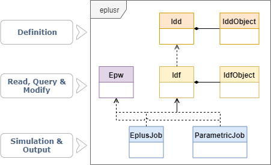

```{r setup, include = FALSE}
knitr::opts_chunk$set(
    collapse = TRUE,
    comment = "#>",
    screenshot.force = FALSE,
    fig.align = "center"
)

# the default output hook
hook_output = knitr::knit_hooks$get('output')
knitr::knit_hooks$set(output = function(x, options) {
    if (!is.null(n <- options$out.lines)) {
        x <- unlist(strsplit(x, '\n', fixed = TRUE))
        if (length(x) > n) {
            # truncate the output
            x <- c(head(x, n), '....', '')
        } else {
            x <- c(x, "")
        }
        x <- paste(x, collapse = '\n') # paste first n lines together
    }
    hook_output(x, options)
})

knitr::opts_knit$set(root.dir = tempdir())

options(crayon.enabled = FALSE)

can_run <- eplusr:::os_type() != "unknown"
```

eplusr provides a rich toolkit of using whole building energy simulation program
[EnergyPlus](https://energyplus.net) directly in R, which enables programmatic
navigation, modification of EnergyPlus models, conducts parametric simulations
and retrieves outputs. More information about EnergyPlus can be found at [its
website](https://energyplus.net).

## Installation

You can install the latest stable release of eplusr from CRAN.

```{r cran-install, eval = FALSE}
install.packages("eplusr")
```

Alternatively, you can install the development version from GitHub.

```{r gh-installation, eval = FALSE}
# install.packages("remotes")
remotes::install_github("hongyuanjia/eplusr")
```

Since running the IDF files requires EnergyPlus (https://energyplus.net),
EnergyPlus has to be installed before running any models. There are helper
functions in eplusr to download and install it automatically on major operating
systems (Windows, macOS and Linux):

```{r eplus-install, eval = FALSE}
# install the latest version (currently v9.1.0)
eplusr::install_eplus("latest")

# OR download the latest version (currently v9.1.0) and run the installer
# manually by yourself
eplusr::download_eplus("latest", dir = tempdir())
```

Note that the installation process in `install_eplus()` requires
**administrative privileges**. If you are not in interactive mode, you have to
run R with administrator (or with sudo if you are on macOS or Linux) to make it
work.

```{r install_eplus, include = FALSE, eval = can_run}
# download portable EnergyPlus
if (!eplusr::is_avail_eplus(8.8)) {
    binary_url <- eplusr:::eplus_download_url(8.8)
    if (eplusr:::is_windows()) {
        ext <- ".zip"
    } else {
        ext <- ".tar.gz"
    }
    port_url <- paste0(tools::file_path_sans_ext(binary_url), ext)
    dest <- file.path(tempdir(), basename(port_url))
    dl <- eplusr:::download_file(port_url, dest)
    eplus_dir <- file.path(tools::file_path_sans_ext(basename(binary_url)), "EnergyPlus-8-8-0")
    if (eplusr:::is_windows()) {
        unzip(dest, exdir = tempdir())
    } else {
        untar(dest, exdir = tempdir())
    }
    eplusr::use_eplus(file.path(tempdir(), eplus_dir))
}
```

## Features

* Read, parse and modify EnergyPlus Input Data File (IDF)
* Read, parse and modify EnergyPlus Weather File (EPW)
* Query on models, including classes, objects and fields
* Directly add, modify, duplicate, insert, and delete objects of IDF
* Automatically change referenced fields when modifying objects
* Save changed models into standard formats in the same way as IDFEditor
  distributed along with EnergyPlus
* Run your models and collect the simulation output
* Conduct parametric energy simulations and collect all results in one go

## Class structure

Below shows the class structure in eplusr.

```{r, echo = FALSE, eval = can_run, include = can_run, figure.width = "400px"}

```

Basically, eplusr uses `Idf` class to present the whole IDF file and `IdfObject`
class to present a single object in an IDF. Both `Idf` and `IdfObject` class
contain member functions for helping modify the data in IDF so it complies with
the underlying EnergyPlus IDD (Input Data Dictionary). Similarly, IDD file is
wrapped into two classes, i.e. `Idd` and `IddObject`.

Besides, `Epw` class is used to present EnergyPlus Weather files; `EplusJob` to
run single EnergyPlus simulation and collect outputs, `ParametricJob` to run
parametric EnergyPlus simulations and collect all outputs.

It is highly recommended to read the documentation to get a thorough
understanding on each class.

```{r copy_example, include = FALSE, eval = can_run}
library(eplusr)

cfg <- eplus_config(8.8)

example_name <- "5Zone_Transformer.idf"
weather_name <- "USA_CA_San.Francisco.Intl.AP.724940_TMY3.epw"
ddy_name <- "USA_CA_San.Francisco.Intl.AP.724940_TMY3.ddy"

path_example <- file.path(cfg$dir, "ExampleFiles", example_name)
path_weather <- file.path(cfg$dir, "WeatherData", weather_name)
path_ddy <- file.path(cfg$dir, "WeatherData", ddy_name)

file.copy(path_example, tempdir(), overwrite = TRUE)
file.copy(c(path_weather, path_ddy),
  file.path(tempdir(), c("San_Francisco.epw", "San_Francisco.ddy")), overwrite = TRUE)
```

## Read and parse

All IDF reading process starts with function `read_idf()`, which returns an `Idf`
object. The model will be printed in a similar style you see in IDFEditor, with
additional heading lines showing the `Path`, `Version` of the model. The classes
of objects in the model are ordered by groups and the number of objects in
classes are shown in square bracket.

Parsing an IDF requires the IDD data of that version, which serves as the
schema. Usually, when you try to edit an IDF, the corresponding EnergyPlus is
likely to be installed already. If EnergyPlus is installed in standard location
(`C:\EnergyPlusVX-Y-0` on Windows, `/usr/local/EnergyPlus-X-Y-0` on Linux and
`/Applications/EnergyPlus-X-Y-0` on macOS), eplusr is able to find it and use
the `Energy+.idd` file distributed with that release to parse the input IDF.
The IDD file will be parsed first and an `Idd` object will be created and
cached. That `Idd` object will be reused whenever parsing IDFs with that
version. For more details, please see `?use_idd()` and `?idd`.

Sometimes you may just want to edit the model without installing the whole
EnergyPlus software. You can just download the IDD file of that version using
`download_idd()` or set `download` to `TRUE` in `use_idd()`. The code below will
download IDD file for EnergyPlus v8.8.0, parse it and create an `Idd` object
that will be used whenever parsing all EnergyPlus models of version v8.8.

```{r idd_dl, eval = FALSE}
path_idd <- download_idd(8.8, dir = tempdir())
use_idd(path_idd)

# OR
use_idd(8.8, download = TRUE)
```

Now let's read an IDF file distributed with EnergyPlus 8.8.0. As we have already
got the IDD, we can just ignore the `idd` argument.

```{r idd_solaris, include = FALSE, eval = !can_run}
library(eplusr)
use_idd(8.8, download = TRUE)
path_example <- "https://raw.githubusercontent.com/NREL/EnergyPlus/v8.8.0/testfiles/5Zone_Transformer.idf"
path_weather <- "https://raw.githubusercontent.com/NREL/EnergyPlus/v8.8.0/weather/USA_CA_San.Francisco.Intl.AP.724940_TMY3.epw"
path_ddy <- "https://raw.githubusercontent.com/NREL/EnergyPlus/v8.8.0/weather/USA_CA_San.Francisco.Intl.AP.724940_TMY3.ddy"

eplusr:::download_file(path_example, file.path(tempdir(), basename(path_example)))
eplusr:::download_file(path_weather, file.path(tempdir(), "San_Francisco.epw"))
eplusr:::download_file(path_ddy, file.path(tempdir(), "San_Francisco.ddy"))
```

```{r read, out.lines = 10}
model <- read_idf(path = "5Zone_Transformer.idf", idd = NULL)

model
```

`Idf` class provides lots of methods to programmatically query and modify
EnergyPlus models. See table below.  This vignette will demonstrate some of
them.

| Category            | Method                   | Functionality                                     |
| :---                | :---                     | :---                                              |
| Basic Info          | `$version()`             | Get Idf version                                   |
|                     | `$path()`                | Get Idf file path                                 |
|                     | `$group_name()`          | Get group names                                   |
|                     | `$class_name()`          | Get class names                                   |
|                     | `$is_valid_group()`      | Check group existence                             |
|                     | `$is_valid_class()`      | Check class existence                             |
| Definition          | `$definition()`          | Get corresponding `IddObject`                     |
| Object Info         | `$object_id()`           | Get object unique ID                              |
|                     | `$object_name()`         | Get object name                                   |
|                     | `$object_num()`          | Get object number in class                        |
|                     | `$is_valid_id()`         | Check object ID existence                         |
|                     | `$is_valid_name()`       | Check object name existence                       |
| Object Relation     | `$object_relation()`     | Get object relation with others                   |
| Object Query        | `$object()`              | Get single object                                 |
|                     | `$objects()`             | Get multiple objects                              |
|                     | `$object_unique()`       | Get the unique object                             |
|                     | `$objects_in_class()`    | Get objects in class                              |
|                     | `$objects_in_group()`    | Get objects in group                              |
|                     | `$objects_in_relation()` | Get objects in relation                           |
|                     | `$search_object()`       | Get objects using regular expression              |
| Object Modification | `$dup()`                 | Duplicate objects                                 |
|                     | `$add()`                 | Add new objects                                   |
|                     | `$set()`                 | Modify existing objects                           |
|                     | `$del()`                 | Delete existing objects                           |
|                     | `$rename()`              | Change object names                               |
|                     | `$insert()`              | Add new objects from other `IdfObject`s           |
|                     | `$load()`                | Add new objects from strings and data.frames      |
|                     | `$update()`              | Update object values from strings and data.frames |
|                     | `$paste()`               | Add new objects from IDF Editor `Copy obj`        |
|                     | `$search_value()`        | Get objects whose values match regular expression |
|                     | `$replace_value()`       | Modify object values using regular expression     |
| Validation          | `$validate()`            | Check any errors in `Idf`                         |
|                     | `$is_valid()`            | Check if no error exists in `Idf`                 |
| Data Extraction     | `$to_table()`            | Extract `Idf` data in data.frames                 |
|                     | `$to_string()`           | Extract `Idf` data in strings                     |
| Save                | `$is_unsaved()`          | Check if unsaved changes exist                    |
|                     | `$save()`                | Save `Idf` to an `.idf` file                      |
| Clone               | `$clone()`               | Create an copy                                    |
| Run                 | `$run()`                 | Run `Idf` together with an `Epw`                  |
| Print               | `$print()`               | Print `Idf` in different details                  |

Table: Methods of `Idf` class

Below will show same example usage of methods listed above.

## Basic Info

If you want to see what groups and classes exist in your model, use
`$group_name()` and `$class_name()` respectively.

```{r all_grp, out.lines = 5}
model$group_name()
```

```{r all_cls, out.lines = 5}
model$class_name()
```

You can use `$is_valid_group()` and `$is_valid_class()` to check if curtain
groups or names exist in current model.

```{r chk_grp}
model$is_valid_group("Schedules")
model$is_valid_class("ZoneInfiltration:DesignFlowRate")
```

## Class definition

You can get class definition using `$definition()`, which returns an
`IddObject`. All required fields in each class are marked with `*`. For example,
you can get the `IddObject` of class `Material`:

```{r all_field}
def_mat <- model$definition("Material")
def_mat
```

You can also achieve this using methods in `Idd` class.

```{r idd_obj, eval = FALSE}
idd <- use_idd(8.8)
idd$Material

# OR
# idd$object("Material")

# OR
# idd_object(8.8, "Material")
```

With the `IddObject`, you can easily get class and field properties using
methods it has.

For example, you can get all default field values using `$field_default()`.  As
we did not give any field index or name, a list is returned containing default
values of all fields. The type of each value will be consistent with field
definition.

> NOTE: For numeric fields with default values being `"autosize"` or
> `"autocalculate"`, the type of returned values will be "character".

```{r mat_def}
def_val <- def_mat$field_default()
str(def_val)
```
Please see `?IddObject` for detailed documentation on `IddObject` class.

## Get object

In an `Idf`, each object in the model is assigned with an unique `ID` according
to its appearance sequence in the IDF file. You can find all valid `ID`s using
`$object_id()`.

```{r all_id}
model$object_id(class = c("Material", "Construction"), simplify = FALSE)
```

You can get all object names using `$object_name()`. If the class does not have
name attribute, `NA` will returned.

```{r obj_nm}
model$object_name(class = c("Version", "Material", "Construction"), simplify = FALSE)
```

Object number in each class can be retrieved using `$object_num()`.

```{r obj_num}
model$object_num(c("BuildingSurface:Detailed", "Material", "Output:Variable"))
```

Having the object ID or name, you can easily get any object using `$object()`
which returns an `IdfObject` or using `$objects()` which returns a list of
`IdfObject`s.

> NOTE: The matching of object names is case-insensitive. For instance,
> `model$object("rOoF")` is equivalent to `model$object("roof")`.

```{r obj}
model$objects(c("WD10", "ROOF-1"))
```

If you want to get all objects in a single class, use `$objects_in_class()`.

```{r obj_in_cls, out.lines = 30}
model$objects_in_class("Material")
```

Also, you can get all objects in a single class using `"$"` or `"[["`. Class
names can be given in underscore-style. For example, you can just use
`model$Material_NoMass` instead of `` model$`Material:Nomass` `` to save some
typing.

```{r obj_in_cls_shortcut_1, out.lines = 30}
model$Material_NoMass
# OR
# model[["Material_NoMass"]]
```

Based on the above, if you want to get the first object in class `RunPeriod`,
you can simply run:

```{r rp}
rp <- model$RunPeriod[[1]]
```

For unique object, such like `SimulationControl` and `Building`, you can use
`$object_unique()`

```{r objuni}
model$object_unique("Building")

# OR just
# model$Building
```

Many fields in a model can be referred by others. For example, the `Outside
Layer` and other fields in `Construction` class refer to the `Name` field in
`Material` class and other material related classes. Here it means that the
`Outside Layer` field **refers to** the `Name` field and the `Name` field is
**referred by** the `Outside Layer`. `$object_relation()` provides a simple
interface to get this kind of relation. It takes a single object ID or name and
also a relation direction, and returns an `IdfRelation` object which contains
data presenting such relation above.

```{r rel}
model$object_name("Material:NoMass")
model$object_relation("mat-clng-1")
```

Above shows that no-mass material `MAT-CLNG-1` is used at the outside layer of a
construction named `CLNG-1`. You can extract both of them using
`$objects_in_relation()`.

```{r obj_rel}
mat_const <- model$objects_in_relation("mat-clng-1", "ref_by")
mat_const
```

After you get the objects, you can perform detailed modifications on them using
methods `$set()` in both `Idf` and `IdfObject` class.

Similarly, you can use `"$"` and `"[["` to get a single value in
an `IdfObject` class or `"["` to get multiple values just like normal lists in
R.

```{r s3_obj}
rp$Begin_Day_of_Month

# OR
# rp[["Begin_Day_of_Month"]]
# rp[[3]]
```

You can also make a chain.

```{r chain}
model$RunPeriod$WinterDay$Begin_Day_of_Month
```

## Modify object

There are two ways to modify objects in eplusr. One is using methods in `Idf`
which works on multiple objects, and the other way is using methods in
`IdfObject` which only works for a single object.

> NOTE: Validations are performed during object modifications under different
> strictness level (`none`, `draft`, `final` or custom yours using
> `custom_validate()`). For detailed explanations, please see `?level_checks`.

`Idf` class provides 9 methods for modifying objects, including `$dup()`,
`$add()`, `$set()`, `$del()`, `$rename()`, `$insert()`, `$load()` `$update()`
and `$paste()`.

Object IDs will be appended after new objects are added, and the most-newly
added object will always have the max ID. Object IDs will never be reused, even
though their binded objects have been deleted using `$del()`.

For modifying object's comments and values, you can also use `$comment()`
and `$set()` in `IdfObject` class.

### Duplicate objects

`$dup()` duplicates objects specified by object IDs or names. If the
target classes have a name attribute, you can assign new names to the duplicated
objects in form `new_name = "old_name"`. If new name is not given, the newly
added object will have the same name as the original object except a appended
suffix of "`_1`", "`_2`" and etc.

```{r dup}
model$dup(c(my_roof = "ROOF-1", "ROOF-1", "WALL-1"))
```

### Add new objects

You can add new objects using `$add()`. With `.default` being `TRUE`, the
default behavior, all empty fields are filled with default values, if possible.
Only minimum fields will be added by default. But you can change it by setting
`.all` to `TRUE`.

You can also add new comments alongside with new values using the special
element `.comment`.

For example, here we add two new objects with comments in `RunPeriod` class:

```{r add_obj}
rp1 <- list(RunPeriod = list("rp_test_1", 1, 1, 2, 1, .comment = c("Comment for new object 1", "Another comment")))

model$add(rp1,
  RunPeriod = list(name = "rp_test_2", begin_month = 3, begin_day_of_month = 1,
    end_month = 4, end_day_of_month = 1, .comment = "Comment for new object 2"
  )
)
```

### Set new values and comments

Changing values of existing objects can be conducted using `$set()` in
`Idf` and `IdfObject`:

```{r set_obj}
model$set(
  rp_test_1 = list(name = "rp_test_3", begin_day_of_month = 2,
    .comment = c(format(Sys.Date()), "begin day has been changed.")
  )
)
```

For setting a single value, you can even write in a chain:

```{r set_chain}
(model$RunPeriod$rp_test_2$End_Day_of_Month <- 2)
```

Also, if the modified fields are referenced by fields in other objects, the
corresponding fields will also be updated.

```{r set_ref}
mat <- model$Material$CC03

mat$value_relation("Name")

mat$set(name = "CC03_renamed")

mat$value_relation("Name")
```

Sometimes, you may want to get all possible values of fields before you change
them. You can achieve that by using `$value_possible()` method in `IdfObject`
class.

```{r possible}
mat$value_possible(c(2, 7))
```

### Insert objects

Sometimes it may be useful to insert objects from other IDFs. For example, you
may want to import some design days and update location data from a ".ddy" file.
You can achieve that using `$insert()`.

```{r ddy, warning=TRUE, out.lines = 20}
# read ddy file as normal IDF
ddy <- read_idf("San_Francisco.ddy", idd = 8.8)

model$insert(ddy$SizingPeriod_DesignDay)

# get location data
loc <- ddy$Site_Location$value()

model$Site_Location$set(loc)

```

### Load objects

Here `load` means **insert**. You can use character vectors or data.frames to
load new objects.

```{r load_chr}
mat_chr <- c("Construction,", "new_const1,", paste0(model$Material[[1]]$name(), ";"))
model$load(mat_chr)

# extract first construction data in a data.table
dt <- model$Construction[[1L]]$to_table()
# modify value
dt[1, value := "new_const2"]
model$load(dt)
```

The relation is automatically generated whenever new fields are added or
modified.

```{r}
model$object_relation("new_const1")
model$object_relation("new_const2")
```

### Update objects

Here `update` means **set**. You can use character vectors or data.frames to
update existing objects.

```{r update_chr}
mat_chr <- model$Material$WD10$to_string()
# change material density
mat_chr[6] <- "600,"
model$update(mat_chr)

# extract roof construction data in a data.table
dt <- model$Construction$`ROOF-1`$to_table()
# modify value
dt[1, value := "ROOF"]
model$update(dt)
```

### Delete object

`$del()` will delete objects specified by object IDs or names.
For example, in current model, there is a material named `"MAT-CLNG-1"` in class
`Material:NoMass`. Let's see if it has been referred by other objects.

```{r ref_by}
model$Material_NoMass$`MAT-CLNG-1`$value_relation()
```

As we can see, `MAT-CLNG-1` has been referred by a construction named
`"CLNG-1"`.

First, let's try to direct delete Material `MAT-CLNG-1`.

```{r del, error = TRUE}
model$del("mat-clng-1")
```

We got an error, because directly deleting `MAT-CLNG-1` will introduce invalid
reference in Construction `CLNG-1`.

In some cases, you may still want to delete that object. You can achieve this by
setting `.force` to `TRUE`.

```{r del_1}
model$del("mat-clng-1", .force = TRUE)
```

### Paste from IDF Editor

Once an IDF file is opened in IDF Editor, you can copy objects by clicking the
`Copy Obj` button in IDF Editor, and use `$paste()` to insert those objects into
current `Idf`. Note that IDF Editor only exists on Windows, which means that
`$paste()` will also work only on that platform.

## Validate

`$validate()` checks if there are errors in current `Idf` under specified
validation level. You can customize what kind of errors to check by changing the
`level` argument. The default validation level is equal to
`eplusr_option("validate_level")`.

There are 10 different validation check components in total. Three predefined
validation level are included, i.e. `"none"`, `"draft"` and `"final"`. To get
what validation components those levels contain, use `level_checks()`.

```{r validate}
eplusr_option("validate_level")
str(level_checks("final"))
```

In the previous section, we deleted a material named `MAT-CLNG-1`.

The `final` validation level turns all checking components on. We can just
trigger invalid reference checking using `custom_validate()` function.

```{r valid}
model$validate(custom_validate(reference = TRUE))
```

As we can see, the invalid reference in construction `CLNG-1` is successfully
detected.

In this example, we already knows that `CLNG-1` is the invalid object. In many
cases, we don't know that information in advance. As `$validate()` returns a
list of `data.table`s, we can extract invalid objects for different types
directly using `$validate()`. Below we extract all objects that have invalid
reference errors.

```{r}
(id <- model$validate()$invalid_reference$object_id)
model$objects(id)
```

Then we can use `$set()` to correct them. We can get all possible values for
field `Outside Layer` using `$value_possible()` method in `IdfObject` class.

```{r}
model$object(id)$value_possible("Outside Layer")$source
```

Now let's change the construction's `Outside Layer` to `WD10`.

```{r}
model$object(id)$set(Outside_Layer = "WD10")
```

## Save

You can save your model using `$save()`. If no path is given, the path of model
itself will be used. This may overwrite the current file which has a risk of
losing your original file and data. You have to set `overwrite` to `TRUE` to
confirm the process.

```{r save, eval = FALSE}
model$save(overwrite = TRUE)

model$save("test.idf")
```

## Run and Collect Output

eplusr uses the EnergyPlus command line interface which was introduced since
EnergyPlus v8.3.0, which means that `$run()` only supports models with version
higher than v8.3.0.

eplusr will auto-detect already installed EnergyPlus in the standard
installation locations. You can get all detected EnergyPlus versions using
`avail_eplus()`.

```{r avail_eplus}
avail_eplus()
```

`$run()` will issue an error if corresponding version of EnergyPlus is not found.
If your EnergyPlus was not installed in standard location, you can add that
location using `use_eplus()`. After adding, all models of that version will use
this path to call EnergyPlus.

```{r use_eplus, eval = FALSE}
use_eplus("C:/EnergyPlusV8-8-0")
```

If the needed version of EnergyPlus was not installed, you can use
`install_eplus()` to install it.

```{r install, eval = FALSE}
install_eplus(ver = 8.8)
```

`$run()` will run the current model with specified weather using corresponding
version of EnergyPlus. The model and the weather used will be copied to the
output directory. An `EplusJob` object will be returned which provides detailed
information of the simulation and methods to collect simulation output. Please
see `?EplusJob` for details.

```{r run, eval = can_run, out.lines = 10}
# read the model again
model <- read_idf("5Zone_Transformer.idf")
path_epw <- "San_Francisco.epw"

job <- model$run(path_epw, wait = TRUE)
```

### Print simulation errors

You can get simulation errors using `$errors()`.

```{r errors, eval = can_run}
job$errors()
```

### Retrieve simulation output

eplusr uses the EnergyPlus SQL output for extracting simulation output. In
order to do so, an object in `Output:SQLite` class with `Option Type` value of
`SimpleAndTabular` will be automatically created if it does not exists.
`EplusJob` has provided some wrappers that do SQL queries to get report data
results, i.e. results from `Output:Variable` and `Output:Meter*`. But for
`Output:Table` results, you have to be familiar with the structure of the
EnergyPlus SQL output, especially for table *"TabularDataWithStrings"*. For
details, please see *"2.20 eplusout.sql"*, especially *"2.20.4.4 TabularData
Table"* in EnergyPlus *"Output Details and Examples"* documentation.

`$report_data_dict()` returns a data.table which contains all information about
report data. For details on the meaning of each columns, please see
*"2.20.2.1 ReportDataDictionary Table"* in EnergyPlus *"Output Details and
Examples"* documentation.

```{r dict, eval = can_run}
str(job$report_data_dict())
```

`$report_data()` extracts the report data using key values and variable names.
Just for demonstration, let's get the transformer input electric power at 11 a.m
for the first day of RunPeriod named `SUMMERDAY`, tag this simulation as case
`example`, and return all possible output columns.

```{r output, eval = can_run}
power <- job$report_data("transformer 1", "transformer input electric power", case = "example",
  all = TRUE, simulation_days = 1, environment_name = "summerday", hour = 11, minute = 0)

str(power)
```

`$report_data()` can also directly take the whole or subset results of
`$report_data_dict()` to extract report data. In some case this may be quite
handy. Let's get all report variable with celsius degree unit.

```{r dict_extract, eval = can_run}
str(job$report_data(job$report_data_dict()[units == "C"]))
```

`$tabular_data()` extracts tabular data. For details on the meaning of each
columns, please see *"2.20.4.4 TabularData Table"* in EnergyPlus *"Output
Details and Examples"* documentation.

Now let's get the total site energy per total building area. Note that the
`value` column in the returned `data.table` is character types, as some table
store not just numbers. We need to manually convert it.

```{r tab, eval = can_run}
site_energy <- job$tabular_data(column_name = "energy per total building area", row_name = "total site energy")
site_energy[, value := as.numeric(value)]
str(site_energy)
```

```{r del_job, include = FALSE, eval = can_run}
clean_wd(model$path())
```

## Run Parametric Analysis

eplusr provides tools to do parametric simulations which take full advantages of
eplusr's model editing and result collecting functionalities. You can create a
parametric job using `param_job()`, which takes an IDF file or an `Idf` object
as the *seed* and an EPW file or an `Epw` object as *weather*.

```{r param, eval = can_run}
param <- param_job(idf = model, epw = path_epw)

param
```

`param_job()` returns a `ParametricJob` object which provides a prototype of
conducting parametric analysis of EnergyPlus simulations. For more details,
please see `?param`.

### Apply measure

`$apply_measure()` allows to apply a measure to an `Idf` and create parametric
models for simulations. Here, the concept of measure in eplusr is inspired by
"measures" in [OpenStudio](https://nrel.github.io/OpenStudio-user-documentation/getting_started/about_measures/).
Basically, a measure is just a function that takes an `Idf` object and other
arguments as input, and returns a modified `Idf` object as output. Use `...` to
supply different arguments to that measure.

Let's create a function that modifies infiltration rate:

```{r mea, eval = can_run}
set_infil_rate <- function (idf, infil_rate) {

  # validate input value
  # this is optional, as validations will be made when setting values
  stopifnot(is.numeric(infil_rate), infil_rate >= 0)

  if (!idf$is_valid_class("ZoneInfiltration:DesignFlowRate"))
    stop("Input model does not have any object in class `ZoneInfiltration:DesignFlowRate`")

  # get all object IDS
  ids <- idf$object_id("ZoneInfiltration:DesignFlowRate", simplify = TRUE)

  # make a list of new values to set
  new_val <- list(design_flow_rate_calculation_method = "AirChanges/Hour", air_changes_per_hour = infil_rate)

  # create proper format for all objects in that class
  val <- rep(list(new_val), length(ids))
  names(val) <- paste0("..", ids)

  idf$set(val)

  idf
}
```

The measure `set_infil_rate()` is pretty simple. First, it gets all
objects in class `ZoneInfiltration:DesignFlowRate`. Then it sets ACH in all
zones to the input value.

Now, let's apply this measure to the seed model with different infiltration
rates from 0.0 to 4.0, respectively.

```{r apply, eval = can_run}
param$apply_measure(set_infil_rate, seq(0, 4, by = 1), .names = NULL)
```

As we can see, 5 models have been created. As we left `.names` as `NULL`, each
newly created models will be named as a combination of measure name and model
number.

### Run in parallel and collect results

Now let's run the parametric job. All simulations will be run in parallel. The
number of parallel EnergyPlus processes can be specified using option
`num_parallel`. Now let's run all simulations and wait them to finish.

```{r param_run, eval = can_run}
param$run(wait = TRUE)
```

After all simulations completed, let's see the variations of total energy.

```{r param_res, eval = can_run}
tab <- param$tabular_data(
  table_name = "Site and Source Energy",
  column_name = "Total Energy",
  row_name = "Total Site Energy"
)

total_eng <- tab[, list(case, `Total Energy (GJ)` = as.numeric(value))]
```

```{r eval = FALSE}
total_eng
```

```{r echo = FALSE, results="asis", eval = can_run}
knitr::kable(total_eng)
```

```{r del_param, include = FALSE, eval = can_run}
dir_nms <- paste0("set_infil_rate_", 1:5)
lapply(dir_nms, unlink, recursive = TRUE, force = TRUE)
```

```{r clean_files, include = FALSE, eval = can_run}
unlink(file.path(tempdir(), c(example_name, "San_Francisco.epw", "San_Francisco.ddy")))
```
