```{r setup, include = FALSE}
knitr::opts_chunk$set(
    collapse = TRUE,
    comment = "#>",
    screenshot.force = FALSE,
    fig.align = "center",
    out.lines = 20
)

# the default output hook
hook_output = knitr::knit_hooks$get('output')
knitr::knit_hooks$set(output = function(x, options) {
    if (!is.null(n <- options$out.lines)) {
        x <- unlist(strsplit(x, '\n', fixed = TRUE))
        if (length(x) > n) {
            # truncate the output
            x <- c(head(x, n), '....', '')
        } else {
            x <- c(x, "")
        }
        x <- paste(x, collapse = '\n') # paste first n lines together
    }
    hook_output(x, options)
})

options(crayon.enabled = FALSE)
options(data.table.print.class = TRUE)

library(eplusr)
if (!is_avail_eplus(22.1)) install_eplus(22.1)
```

This vignette introduces the `IdfGeometry` and `IdfViewer` classes.
`IdfGeometry` is designed to extract data for all geometry objects and perform
geometric operations on them, while `IdfViewer` is to view IDF geoemtry in 3D
using the [rgl](https://cran.r-project.org/package=rgl) package in a similar
way as OpenStudio SketchUp Plugin.

---

# Extract all geometry data

All geometry data in an `Idf` object can be extracted using the
`Idf$geometry()`. What it returns is an `IdfGeometry` which parses all geometry
related objects, including:

* `GlobalGeometryRules`
* `Building`
* `Zone`
* All geometry related classes in the `Thermal Zones and Surfaces` group and
  `Daylighting` group

```{r}
path_idf <- file.path(eplus_config(22.1)$dir, "ExampleFiles/HospitalLowEnergy.idf")
idf <- read_idf(path_idf)
geom <- idf$geometry()
geom
```

# Get geometry data

## Get geometry rules

```{r}
geom$rules()
```

## Get surface area

```{r}
geom$area()
```

By default, `$area()` returns areas of all surfaces in current `Idf`. You can
specify `class` and `object` to only calculate objects of interest. This is
also true for the `$azimuth()` and `$tilt()` methods.

```{r}
geom$area(class = "Shading:Zone:Detailed")
```

With `net` being `TRUE`, the window and door areas will be excluded in the
results of surfaces.

```{r}
geom$area()[type == "Wall"]
geom$area(net = TRUE)[type == "Wall"]
```

## Get surface azimuth and tilt

```{r}
geom$azimuth()
geom$tilt()
```

# Convert simple geometry

`$convert()` generate detailed vertices from simplified geometry
specifications and replace the original object with its corresponding
detailed class, including:

* `BuildingSurface:Detailed`
* `FenestrationSurface:Detailed`
* `Shading:Site:Detailed`
* `Shading:Building:Detailed`
* `Shading:Zone:Detailed`

```{r}
path_simple <- file.path(eplus_config(22.1)$dir, "ExampleFiles/4ZoneWithShading_Simple_1.idf")
simple <- read_idf(path_simple)

simple$class_name(by_group = TRUE)["Thermal Zones and Surfaces"]

simple$geometry()$convert()

simple$class_name(by_group = TRUE)["Thermal Zones and Surfaces"]
```

An attribute named `mapping` is attached in the converted `Idf` object which
contains the meta data of objects before and after the conversion.

```{r}
attr(simple, "mapping")
```

# Change coordinate systems

`$coord_system()` converts all vertices of geometries into specified
coordinate systems, e.g. from world to relative, and vice versa.
Besides, it also updates the `GlobalGeometryRules` in parent [Idf]
accordingly.

```{r}
geom$rules()

geom$parent()$to_table("Floor 1 Cafe Slab")

geom$coord_system("world")

geom$parent()$to_table("Floor 1 Cafe Slab")
```

# Round vertices decimal digits

`$round_digits()` performs number rounding on vertices of detailed geometry
object vertices, e.g. `BuildingSurface:Detailed`,
`FenestrationSurface:Detailed` and etc.

`$round_digits()` may be useful for clean up IDF files generated using
OpenStudio which often gives vertices with long trailing digits.

```{r}
geom$round_digits(3)

geom$parent()$to_table("Floor 1 Cafe Slab")
```

# View geometry in 3D

`$view()` uses the [rgl](https://cran.r-project.org/package=rgl)
package to visualize the IDF geometry in 3D in a similar way as
[OpenStudio](https://www.openstudio.net).

`$view()` returns an [IdfViewer] object which can be used to further
tweak the viewer scene.

In the rgl window, the default mouse modes are:

* Left button: Trackball
* Right button: Pan
* Middle button: Field-of-view (FOV). '0' means orthographic
  projection.
* Wheel: Zoom

```{r, eval = FALSE}
viewer <- geom$view()
```

```{r, echo = FALSE}
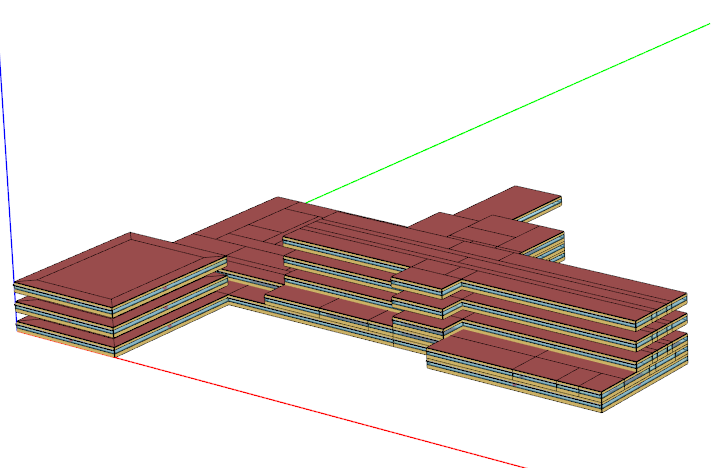
```

## Tweak the view

The `IdfViewer` class provides a number of methods to tweak the view in a
similar style as the OpenStudio SketchUp Plugin:

| Method          | Functionality                                           |
| :---            | :---                                                    |
| `$background()` | Change background                                       |
| `$viewpoint()`  | Change the viewpoint                                    |
| `$mouse_mode()` | Change the mouse controls                               |
| `$axis()`       | Add or remove axis, or tweak the style of axis.         |
| `$ground()`     | Add or remove the ground, or tweak the style of ground. |
| `$wireframe()`  | Turn on/off wireframes.                                 |
| `$x_ray()`      | Turn on/of X-ray style.                                 |
| `$render_by()`  | Change how surfaces should be colored.                  |
| `$show()`       | Change what components/zones/surfaces to show           |

Below shows the effects of each method:

### Change background

```{r, eval = FALSE}
viewer$background("grey50")
``

```{r, echo = FALSE}
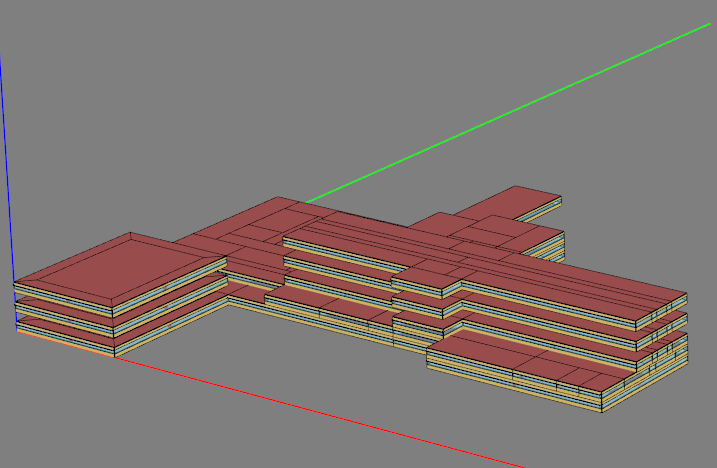
```

```{r, eval = FALSE}
viewer$background("white")
```

```{r, echo = FALSE}
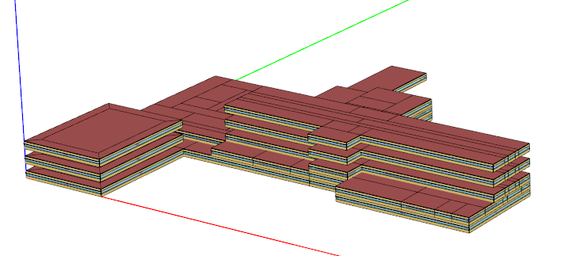
```

### Change viewpoint

```{r, eval = FALSE}
viewer$viewpoint("top")
```

```{r, echo = FALSE}
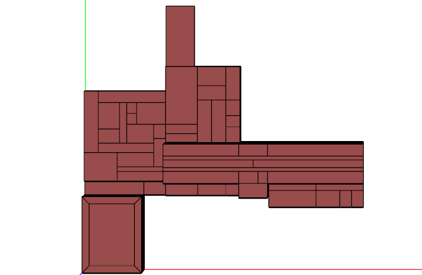
```

```{r, eval = FALSE}
viewer$viewpoint("iso")
```

```{r, echo = FALSE}
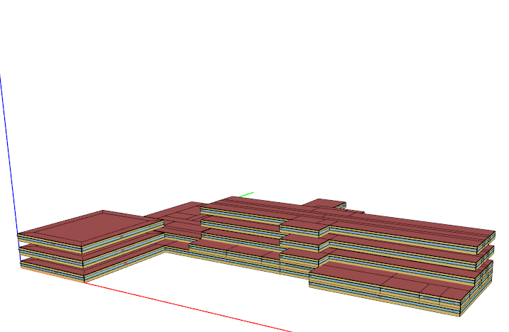
```

### Change axis style

```{r, eval = FALSE}
viewer$axis(width = 5)
```

```{r, echo = FALSE}
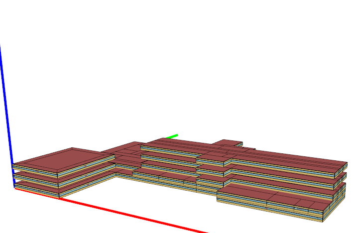
```

```{r, eval = FALSE}
viewer$axis(FALSE)
```

```{r, echo = FALSE}
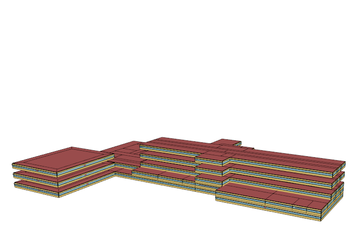
```

### Change ground style

```{r, eval = FALSE}
viewer$ground(TRUE)
```

```{r, echo = FALSE}
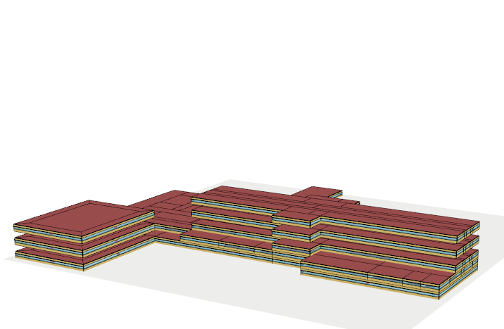
```

### Turn on/off X-ray style

```{r, eval = FALSE}
viewer$x_ray(TRUE)
```

```{r, echo = FALSE}
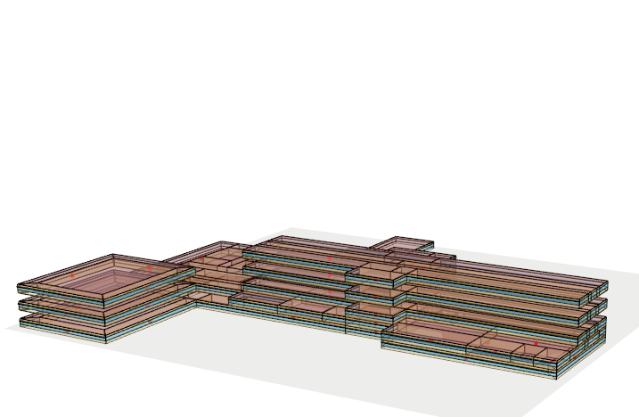
```

```{r, eval = FALSE}
viewer$x_ray(FALSE)
```

```{r, echo = FALSE}

```

### Change render style

```{r, eval = FALSE}
viewer$render_by("zone")
```

```{r, echo = FALSE}
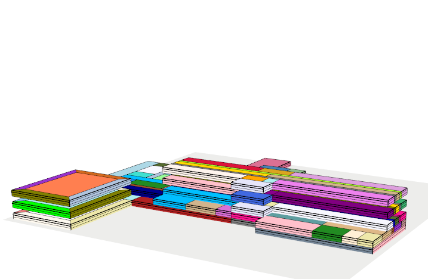
```

```{r, eval = FALSE}
viewer$render_by("surface_type")
```

```{r, echo = FALSE}

```

### Turn on/off components

```{r, eval = FALSE}
viewer$show(zone = "floor 7 clean")
```

```{r, echo = FALSE}
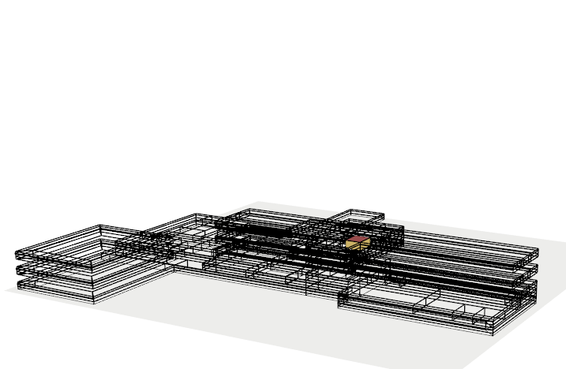
```

```{r, eval = FALSE}
viewer$show(surface = "MOB Floor 5 Perimeter 2 Ext Wall")
```

```{r, echo = FALSE}
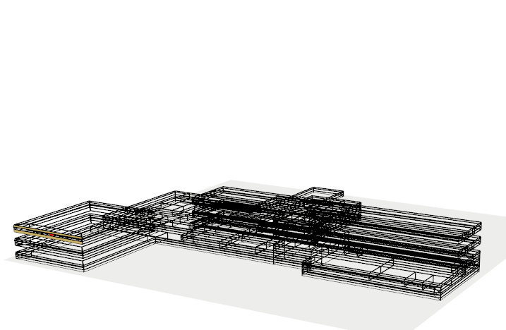
```

```{r, eval = FALSE}
viewer$show(type = "wall")
```

```{r, echo = FALSE}
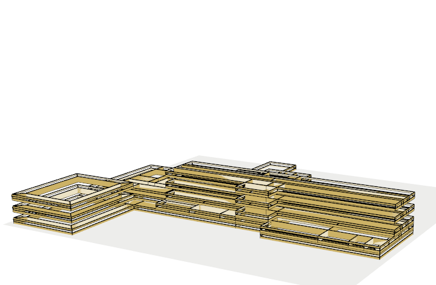
```

## Save the snapshot

`$snapshot()` captures the current rgl view and saves it as an image
file to disk.

```{r, eval = FALSE}
viewer$show()
viewer$snapshot("view.png")
```

```{r, echo = FALSE}

```

## Work with the rgl window

`$win_size()` lets you control the size of the rgl window. `$focus()` brings
the rgl window to the top. `$close()` closes the rgl window.

# Summary

The `IdfGeometry` and `IdfViewer` classes provide utilities to work and
visualize model geometries.

Currently, `IdfGeometry` is still evolving and more
methods will be added to perform geometric transformations in the near future.

Also, new methods will be added in `IdfViewer` to allow visualize simulation
results dynamically.

