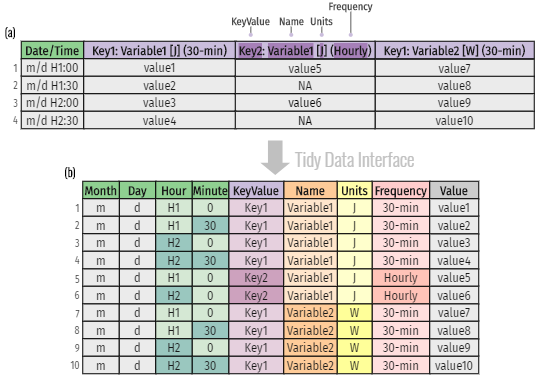

```{r setup, include = FALSE}
knitr::opts_chunk$set(
    collapse = TRUE,
    comment = "#>",
    screenshot.force = FALSE,
    fig.align = "center",
    fig.width = 8,
    fig.height = 6
)

# the default output hook
hook_output = knitr::knit_hooks$get('output')
knitr::knit_hooks$set(output = function(x, options) {
    if (!is.null(n <- options$out.lines)) {
        x <- unlist(strsplit(x, '\n', fixed = TRUE))
        if (length(x) > n) {
            # truncate the output
            x <- c(head(x, n), '....', '')
        } else {
            x <- c(x, "")
        }
        x <- paste(x, collapse = '\n') # paste first n lines together
    }
    hook_output(x, options)
})

options(crayon.enabled = FALSE)
options(data.table.print.class = TRUE)

library(eplusr)
if (!is_avail_eplus(22.1)) install_eplus(22.1)

library(dplyr)
library(ggplot2)
```

This vignette showcases the basic features of the `EplusJob` class with the
main focus on how the tidy data interface can provide a seamless workflow to
extract EnergyPlus output, feed it into data analysis pipelines and turn the
results into understanding and knowledge.

---

# Run simulations

The `Idf` class provides a `$run()` method to call EnergyPlus and run
simulations.

`Idf$run()` will run the current model with specified weather using
corresponding version of EnergyPlus. The model and the weather used will be
copied to the output directory. An `EplusJob` object will be returned which
provides detailed information of the simulation and methods to collect
simulation output. Please see `?EplusJob` for details.

```{r}
path_idf <- file.path(eplus_config(22.1)$dir, "ExampleFiles/5Zone_Transformer.idf")
path_epw <- file.path(eplus_config(22.1)$dir, "WeatherData/USA_CA_San.Francisco.Intl.AP.724940_TMY3.epw")

model <- read_idf(path_idf)
```

## Run only design day simulation

Sometime, you may only want to run a design day simulation. `Idf$run()`
provides a convenient way to do this by setting the `weather` argument to
`NULL`.

```{r, out.lines = 10}
job <- model$run(NULL, dir = tempdir(), wait = TRUE)

class(job)

job
```

`job` prints the path of model and weather, the version and path of EnergyPlus
used to run simulations, and the simulation job status.

You can always retrieve the last simulation job of an `Idf` object using
`Idf$last_job()` method:

```{r}
model$last_job()
```

## Run simulation in the background

By default, when calling `Idf$run()` method, R will hang on and wait for the
simulation to complete. EnergyPlus standard output (stdout) and error (stderr)
is printed to R console. You can make EnergyPlus run in the background by
setting `wait` to `FALSE`. The simulation job status can be shown by printing
the `EplusJob` object or using the `EplusJob$status()` method.

```{r}
job <- model$run(path_epw, tempdir(), wait = FALSE)
job

job$status()
```

```{r, include = FALSE}
while(job$status()$alive) Sys.sleep(0.5)
```

## Print simulation errors

You can get simulation errors using `EplusJob$errors()`.

```{r errors}
print(job$errors())
```

# Retrieve simulation output

eplusr uses the EnergyPlus SQL output for extracting simulation output. In
order to do so, an object in `Output:SQLite` class with `Option Type` value of
`SimpleAndTabular` will be automatically created if it does not exists.
`EplusJob` has provided some wrappers that do SQL queries to get report data
results, i.e. results from `Output:Variable` and `Output:Meter*`. But for
`Output:Table` results, you have to be familiar with the structure of the
EnergyPlus SQL output, especially for table *"TabularDataWithStrings"*. For
details, please see *"2.20 eplusout.sql"*, especially *"2.20.4.4 TabularData
Table"* in EnergyPlus *"Output Details and Examples"* documentation.

## Tidy data interface

`EplusJob` class is designed to extract and represent EnergyPlus simulation
results from the SQLite output into tidy tables. The layout ensures that values
of different variables from the same observation are always paired and is well
fitted for data analyses using the *tidyverse* R package ecosystem.

Table (a) in figure below shows an example of the standard
format from EnergyPlus CSV table output, while Table (b) gives the tidy
representation of the same underlying data.

Although the structure of Table (a) provides efficient storage for completely
crossed designs, it violates with the tidy principles, as variables form both
the rows and columns and column headers are values, not variable names.
Additional data cleaning efforts are needed to work with this structure,
especially considering the missing values (`NA` in row 2 and 4 in Table (a))
introduced by the aggregation of various reporting frequencies, which may
add new inefficiencies and potential errors.

In Table (b), values in column headers have been extracted and converted into
separate columns, and a new variable called `Value` is used to store the
concatenated data values from the previously separate columns.
Moreover, instead of presenting date and time as strings in Table (a), the tidy
data interface splits its components into four new variables, including
`Month`, `Day`, `Hour` and `Minute`.
Taken together, Table (b) forms a nine-variable tidy table and each variable
matches the semantics of simulation output.

```{r tidy-format, echo = FALSE, eval = TRUE, fig.cap = "An example of tidy BES output data representation where Table (a) is the standard output format of EnergyPlus CSV table and Table (b) is the tidy representation of the same underlying data", out.width = "60%"}

```

## Get all possible output meta data

`EplusJob$report_data_dict()` returns a data.table which contains meta data of
report data for current simulation. For details on the meaning of each columns,
please see *"2.20.2.1 ReportDataDictionary Table"* in EnergyPlus *"Output
Details and Examples"* documentation. The most useful columns are:

* `key_value`: Key name of the data
* `name`: Actual report data name
* `is_meter`: Whether report data is a meter data. Possible values:
  `0` and `1`
* `reporting_frequency`: Data reporting frequency
* `units`: The data units

```{r dict}
print(job$report_data_dict())
```

## Retrieve report data

`EplusJob$report_data()` extracts the report data using key values and variable
names. Just for demonstration, let's get the transformer input electric power
at 11 a.m for the first day of RunPeriod named `SUMMERDAY`, tag this simulation
as case `example`, and return all possible output columns.

```{r output}
power <- job$report_data("transformer 1", "transformer input electric power", case = "example",
  all = TRUE, simulation_days = 1, environment_name = "summerday", hour = 11, minute = 0)

print(power)
```

Please note that by default the report data of design day simulations are
always put at the top. If you are only interested in results of specific
run periods, there are 2 ways to do so:

* Set `environment_name` to the run periods you are interested, e.g.:

```{r}
job$report_data(environment_name = c("summerday", "winterday"))
```

* Set `day_type` to specific day types you are interested. A few grouped
  options are also provided:
  - `"Weekday"`: All working days, i.e. from `"Monday"` to `"Friday"`
  - `"Weekend"`: `"Saturday"` and `"Sunday"`
  - `"DesignDay"`: Equivalent to `"SummerDesignDay"` plus `"WinterDesignDay"`
  - `"CustomDay"`: `"CustomDay1"` and `"CustomDay2"`
  - `"SpecialDay"`: Equivalent to `"DesignDay"` plus `"CustomDay"`
  - `"NormalDay"`: Equivalent to `"Weekday"` and `"Weekend"` plus `"Holiday"`

```{r}
job$report_data(day_type = "normalday")
```

`$report_data()` can also directly take the whole or subset results of
`$report_data_dict()` to extract report data. In some case this may be quite
handy. Let's get all report variable with Celsius degree unit.

```{r dict_extract}
print(job$report_data(job$report_data_dict()[units == "C"]))
```

## Retrieve tabular data

`EplusJob$tabular_data()` extracts tabular data of current simulation. For
details on the meaning of each columns, please see *"2.20.4.4 TabularData
Table"* in EnergyPlus *"Output Details and Examples"* documentation.

Now let's get the total site energy per total building area. Note that the
`value` column in the returned `data.table` is character types, as some table
store not just numbers. We need to convert it by setting `string_value` to
`FALSE`.

```{r tab}
site_energy <- job$tabular_data(
    column_name = "energy per total building area", row_name = "total site energy",
    wide = TRUE, string_value = FALSE
)[[1]]
print(site_energy)
```

# Data exploration example

Data exploration is an essential aspect of building energy simulation.
In this example, we will demonstrates the data exploration process of obtaining:

1. energy use intensity (EUI)
2. heating and cooling demand profile

## Run annual simulation

```{r}
path_model <- file.path(eplus_config(22.1)$dir, "ExampleFiles/RefBldgMediumOfficeNew2004_Chicago.idf")
path_weather <- file.path(eplus_config(22.1)$dir, "WeatherData/USA_IL_Chicago-OHare.Intl.AP.725300_TMY3.epw")

idf <- read_idf(path_model)

# make sure weather file input is respected
idf$SimulationControl$Run_Simulation_for_Weather_File_Run_Periods <- "Yes"

# make sure energy consumption is presented in kWh
idf$OutputControl_Table_Style$Unit_Conversion <- "JtoKWH"

# save the modified model into a temporary folder
idf$save(file.path(tempdir(), "MediumOffice.idf"), overwrite = TRUE)

# run annual simulation
job <- idf$run(path_weather, echo = FALSE)
```

## Extract simulation results

Code below shows how to use methods `tabular_data()`, `read_table()` and
`report_data()` provided by the tidy data interface in `EplusJob` to extract
building area and building energy consumption, zone meta data, and cooling and
heating demands, with all formatted in a tidy representation.

Note that instead of presenting the simulated date and time as strings,
the `report_data()` adds a time-series column `datetime` in `POSIXct` based on
a derived year value.
Moreover, the tidy data interface also provides a number of additional columns,
which makes it quite convenient and straightforward to directly perform further
data transformations.

```{r}
# read building area from Standard Reports
print(area <- job$tabular_data(table_name = "Building Area", wide = TRUE)[[1L]])

# read building energy consumption from Standard Reports
print(end_use <- job$tabular_data(table_name = "End Uses", wide = TRUE)[[1L]])

# read zone metadata from Standard Input and Output
print(zones <- job$read_table("Zones"))

# read hourly air-conditioning system output with all additional metadata for
# the annual simulation from Variable Output
print(aircon_out <- job$report_data(
    name = sprintf("air system total %s energy", c("heating", "cooling")),
    environment_name = "annual",
    all = TRUE
))
```

## Data exploration using tidyverse

Code below demonstrate the benefits of the tidy format in selecting columns
using `select()`, subsetting rows using `filter()`, sorting rows using
`arrange()`, adding new variables using `mutate()`, summarizing data using a
combination of `group_by()` and `summarize()`, joining tables using
`left_join()`, and data visualization using `ggplot()`.

### Get EUI breakdown

```{r, out.width = "80%"}
library(dplyr)
library(ggplot2)

# calculate Energy Use Intensity (EUI) for electricity
eui <- end_use %>%
    # only select columns of interest
    select(category = row_name, electricity = `Electricity [kWh]`) %>%
    # get rid of category with empty energy consumption
    filter(electricity > 0.0) %>%
    # order by value
    arrange(-electricity) %>%
    # calculate EUI
    mutate(eui = round(electricity / area$'Area [m2]'[1], digits = 2)) %>%
    # calculate proportion of each category
    mutate(proportion = round(eui / eui[1] * 100, digits = 2)) %>%
    # remove electricity column
    select(-electricity)

# plot a pie chart to show EUI breakdown
eui %>%
    filter(category != "Total End Uses") %>%
    mutate(category = as.factor(sprintf("%s [%.2f%%]", category, proportion, "%"))) %>%
    ggplot(aes("", proportion, fill = category)) +
    geom_bar(stat = "identity", width = 1, color = "black", size = 0.2) +
    coord_polar("y", start = 0)
```

### Get heating and cooling demand profile

```{r, out.width = "80%"}
# calculate air-conditioned floor area per storey
storey <- zones %>%
    # exclude plenum zones
    filter(is_part_of_total_area == 1) %>%
    # group by centroid height
    group_by(centroid_height = round(centroid_z, digits = 4)) %>%
    # calculate total floor area
    summarise(floor_area = sum(floor_area)) %>%
    ungroup() %>%
    # add storey index
    arrange(centroid_height) %>%
    mutate(storey = seq_len(n()), air_system = paste("VAV", storey, sep = "_")) %>%
    select(air_system, floor_area)

# get monthly heating and cooling demands per served area
aircon_out_mon <- aircon_out %>%
    # only consider weekdays
    filter(!day_type %in% c("Holiday", "Saturday", "Sunday")) %>%
    # add an identifier column to indicate cooling and heating condition
    mutate(type = case_when(
        grepl("Heating", name) ~ "Heating",
        grepl("Cooling", name) ~ "Cooling"
    )) %>%
    # add floor area served by each air-conditioning system
    left_join(storey, c("key_value" = "air_system")) %>%
    # calculate the monthly averaged heating and cooling demands in MJ/m2
    group_by(month, type, air_system = key_value) %>%
    summarise(system_output = sum(value) / 1e6 / floor_area[1]) %>%
    ungroup()

# plot a column chart to show the heating and cooling demand profile
aircon_out_mon %>%
    mutate(month = as.factor(month)) %>%
    mutate(system_output = case_when(
        type == "Heating" ~ -system_output,
        type == "Cooling" ~ system_output
    )) %>%
    ggplot() +
    geom_col(aes(month, system_output, group = type, fill = type), position = "dodge") +
    facet_wrap(vars(air_system), ncol = 1) +
    labs(x = "", y = "Heating and cooling demands / MJ m-2")
```

# Summary

In this vignette, we have went through core methods in `EplusJob` class to
run simulations and extract results in tidy format.

In next vignette *"Parametric simulations"*, we will introduce the
`ParametricJob` class to run parametric simulations.

