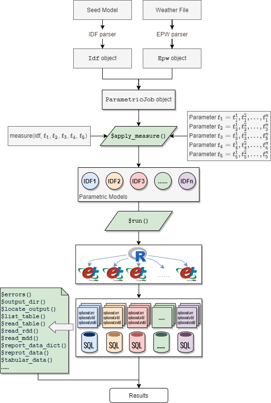

```{r setup, include = FALSE}
knitr::opts_chunk$set(
    collapse = TRUE,
    comment = "#>",
    screenshot.force = FALSE,
    fig.align = "center",
    fig.width = 8,
    fig.height = 6
)

# the default output hook
hook_output = knitr::knit_hooks$get('output')
knitr::knit_hooks$set(output = function(x, options) {
    if (!is.null(n <- options$out.lines)) {
        x <- unlist(strsplit(x, '\n', fixed = TRUE))
        if (length(x) > n) {
            # truncate the output
            x <- c(head(x, n), '....', '')
        } else {
            x <- c(x, "")
        }
        x <- paste(x, collapse = '\n') # paste first n lines together
    }
    hook_output(x, options)
})

options(crayon.enabled = FALSE)
options(data.table.print.class = TRUE)

library(eplusr)
if (!is_avail_eplus(8.8)) install_eplus(8.8)

library(dplyr)
```

This vignette demonstrates the process of performing parametric simulation
analyses using the `ParametricJob` class. The main focuses are on showcasing
the capabilities of (1) creating parametric models by applying measures and (2)
easing the comparative analysis by reusing code snippets developed in data
exploration process.

---

# Parametric prototype

The `ParametricJob` class in eplusr is a parametric prototype that provides a
set of abstractions to ease the process of parametric model generation, design
alternative evaluation, and large parametric simulation management.

An overview of the parametric prototype implementation is shown blow:

```{r, out.width = "70%"}

```

A parametric simulation is initialized using `param_job()` giving a seed model
and a weather file.

```{r}
library(eplusr)
library(dplyr)

path_model <- file.path(eplus_config(8.8)$dir, "ExampleFiles/RefBldgMediumOfficeNew2004_Chicago.idf")
path_weather <- file.path(eplus_config(8.8)$dir, "WeatherData/USA_IL_Chicago-OHare.Intl.AP.725300_TMY3.epw")

idf <- read_idf(path_model)
idf$SimulationControl$Run_Simulation_for_Weather_File_Run_Periods <- "Yes"
idf$OutputControl_Table_Style$Unit_Conversion <- "JtoKWH"
idf$save(file.path(tempdir(), "MediumOffice.idf"), overwrite = TRUE)

# create a parametric prototype of given model and weather file
param <- param_job(idf, path_weather)
```

# Specify design alternatives

Design alternatives are specified by applying a *measure* function to the seed
model. The concept of *measure* in the prototype is inspired by a similar concept
in [OpenStudio](https://nrel.github.io/OpenStudio-user-documentation/getting_started/about_measures/)
but tailored for flexibility and extensibility.

A measure is simply an R function that takes an `Idf` object and any other
parameters as input, and returns a set of modified `Idf` objects as output,
making it possible to leverage other modules in the framework and apply
statistical methods and libraries existing in R to generate design options.

`set_lpd()` blow is a simple measure that modifies the LPD (Lighting Power
Density), and `set_nightplug()` is a measure that modifies the off-work
schedule values of plug loads by multiplying a specified reduction faction
value.

```{r}
# create a measure for modifying LPD
set_lpd <- function (idf, lpd = NA) {
    # keep the original if applicable
    if (is.na(lpd)) return(idf)

    # set 'Watts per Zone Floor Area' in all 'Lights' objects as input LPD
    idf$set(Lights := list(watts_per_zone_floor_area = lpd))

    # return the modified model
    idf
}

# create a measure for reducing plug loads during off-work time
set_nightplug <- function (idf, frac = NA) {
    # keep the original if applicable
    if (is.na(frac)) return(idf)

    # extract the plug load schedule into a tidy table
    sch <- idf$to_table("bldg_equip_sch")

    # modify certain schedule value specified using field names
    sch <- sch %>%
        mutate(value = case_when(
            field %in% paste("Field", c(4,14,16,18)) ~ sprintf("%.2f", as.numeric(value) * frac),
            TRUE ~ value
        ))

    # update schedule object using the tidy table
    idf$update(sch)

    # return the modified model
    idf
}

```

# Create parametric models

After a measure is defined, the method `$apply_measure()` takes it and other
parameter values specified to create a set of models. Different measures can be
chained together.

```{r}
# combine two measures into one
ecm <- function (idf, lpd, nightplug_frac) {
    idf <- set_lpd(idf, lpd)
    idf <- set_nightplug(idf, nightplug_frac)
    idf
}

# apply measures and create parametric models
param$apply_measure(ecm,
                  lpd = c(   NA,  7.0,   5.0,        NA,        NA,           5.0),
       nightplug_frac = c(   NA,   NA,    NA,       0.6,       0.2,           0.2),
               # name of each case
               .names = c("Ori", "T5", "LED", "0.6Frac", "0.2Frac", "LED+0.2Frac")
)
```

# Run parametric simulations in parallel

The `$run()` method will run all parametric simulations in parallel and place
each simulation outputs in a separate folder.
All simulation meta data will keep updating during the whole time and can be
retrieved using the `$status()` method for further investigations.

```{r, out.lines = 30}
param$run()

param$status()
```

# Collect results in one go

The `ParametricJob` class leverages the tidy data interface to retrieve
parametric simulation results in a tidy format.
For all resulting tidy tables, an extra column containing the simulation job
identifiers is prepended in each table. It can be used as an index or key for
further data transformations, analyses and visualization to compare results of
different simulated design options.

```{r, out.lines = 30}
# read building energy consumption from Standard Reports
param_end_use <- param$tabular_data(table_name = "End Uses", wide = TRUE)[[1L]]

print(param_end_use)
```

# Data exploration

After calling the `$run()` method to conduct parallel runs of simulations, the
tidy data interface can be used to extract any simulation outputs of interest
using `$report_data()`, `$tabular_data()`, etc.

In this example, the building energy consumptions of all six
models are extracted using one line of code.
The resulting data format is the same as that of a single simulation and is
equivalent to bind rows from six tables into one tidy table.
A `case` column is prepended using the names specified in `$apply_measure()`.
It works as an identifier to group the results by different parametric models
using `group_by()` and `nest()` functions from the tidyverse package.

This data structure makes it effortless to perform comparative analyses by
taking the code snippets developed in data exploration for a single simulation
and applying them to each of the parametric simulations.

```{r, out.lines = 30}
# read building area from Standard Reports
area <- param$tabular_data(table_name = "Building Area", wide = TRUE)[[1L]]

# calculate EUI breakdown
param_eui <- param_end_use %>%
    select(case, category = row_name, electricity = `Electricity [kWh]`) %>%
    filter(electricity > 0.0) %>%
    arrange(-electricity) %>%
    mutate(eui = round(electricity / area$'Area [m2]'[1], digits = 2)) %>%
    select(case, category, eui) %>%
    # exclude categories that did not change
    filter(category != "Pumps", category != "Exterior Lighting")
print(param_eui)

# extract the seed model, i.e. "Ori" case as the baseline
ori_eui <- param_eui %>% filter(case == "Ori") %>% select(-case)

# calculate energy savings based on the baseline EUI
param_savings <- param_eui %>%
    right_join(ori_eui, by = "category", suffix = c("", "_ori")) %>%
    mutate(savings = (eui_ori - eui) / eui_ori * 100) %>%
    filter(case != "Ori")
print(param_savings)

# plot a bar chart to show the energy savings
library(ggplot2)
param_savings %>%
    mutate(case = factor(case, names(param$models()))) %>%
    ggplot(aes(case, savings, fill = category)) +
    geom_bar(position = "dodge", stat = "identity", width = 0.6, color = "black",
        show.legend = FALSE) +
    facet_wrap(vars(category), nrow = 2) +
    labs(x = NULL, y = "Energy savings / %") +
    coord_flip()
```

# Extensions based on `ParametricJob` class

The `ParametricJob` class is designed to be simple yet flexible and extensible.
One good example of its extensibility is the
[epluspar](https://github.com/hongyuanjia/epluspar) R package, which provides
new classes for conducting specific parametric analyses on EnergyPlus models,
including sensitivity analysis, Bayesian calibration and optimization using
Generic algorithm.

All the new classes introduced are based on the `ParametricJob` class. The main
difference mainly lies in the specific statistical method used for sampling
parameter values when calling `$apply_measure()` method.

